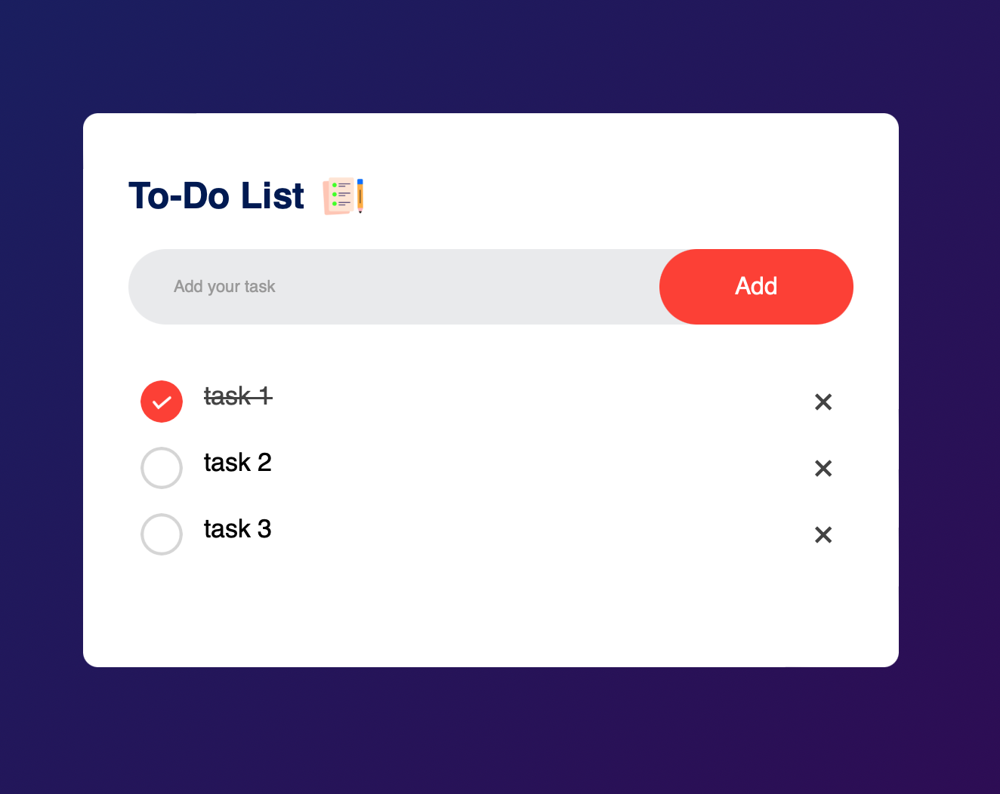

# 📋 To-Do List App

A simple and interactive To-Do List application built using HTML, CSS, and JavaScript. This project helps users manage their daily tasks efficiently with an easy-to-use interface.

## 🚀 Technologies Used

- **HTML** - Semantic structure (<input>, <button>, <ul>)

- **CSS** -  Custom styling and responsive layout

- **JavaScript** - DOM manipulation and local storage

## 🎨 Screenshot


## 🔗 Live Demo
➡ [View the Project]https://cxcxkx.github.io/to-do-list/

## 📂 Installation
1. **Clone the repository:**
   ```bash
   git clone https://github.com/cxcxkx/to-do-list.git

## 📌 Features

- **✅** -  Add tasks to the list
- **✅** -  Mark tasks as completed
- **✅** -  Delete tasks from the list
- **✅** -  Save tasks in local storage
- **✅** -  Minimalistic and modern UI

